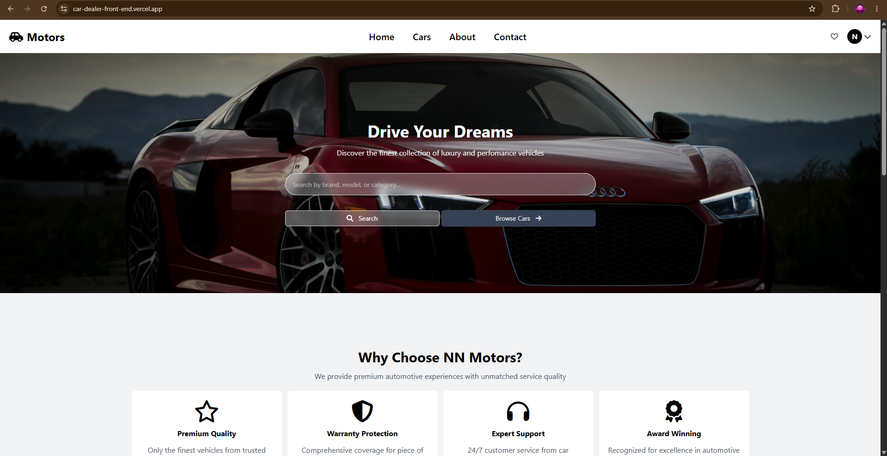
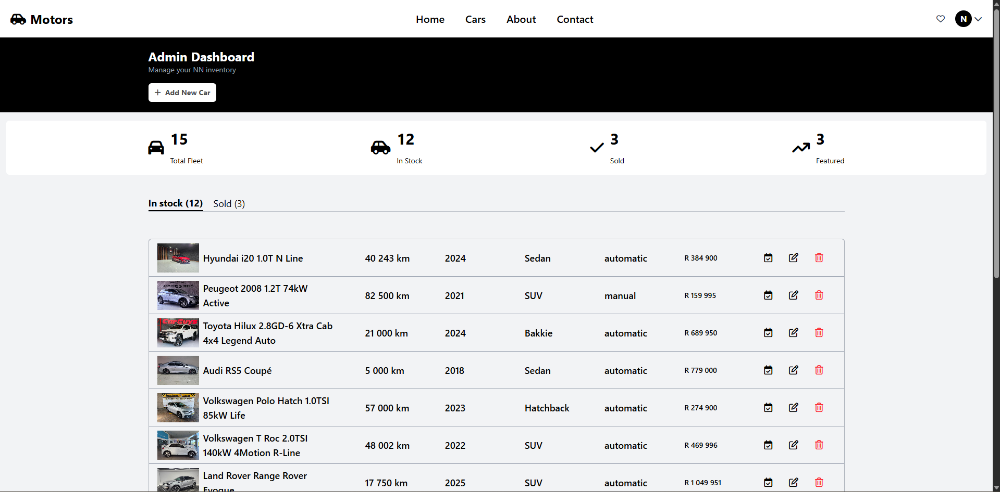

# 🚗 AutoDealer Hub — Client Web Application

A high-performance, responsive web application for automotive dealerships built with **React** and styled with **Tailwind CSS**. Designed to deliver an intuitive inventory browsing experience with dedicated vehicle filtering, responsive media galleries, and an administrative management portal.

🔗 **Live Application:** [View Live Demo](https://car-dealer-front-end.vercel.app/)  
🔗 **Backend Repository:** [AutoDealer API](https://github.com/yourusername/car-dealer-backend)

---

## 🌟 Key Features

* **Dynamic Inventory Showcase:** Real-time vehicle listing with detailed specs (mileage, transmission, fuel type, pricing).
* **Search & Filter System:** Client-side and server-assisted filtering by make, model, price range, and body type.
* **Admin Dashboard:** Secure portal to create, update, and manage vehicle listings with instant state updates.
* **Optimized Image Handling:** Responsive image layouts and fast UI rendering tailored for mobile and desktop viewports.
* **Decoupled Architecture:** Asynchronous data fetching from a custom RESTful Node/Express API.

---

## 🛠️ Tech Stack

* **Framework:** React.js
* **Styling:** Tailwind CSS
* **Icons & Assets:** Font Awesome
* **Routing:** React Router DOM
* **Deployment:** Vercel

---

## 🚀 Getting Started

### Prerequisites
* Node.js (v18+ recommended)
* npm or yarn

### Installation

1. **Clone the repository:**
   ```bash
   git clone [https://github.com/inNetMedia/car-dealer-front-end.git](https://github.com/inNetMedia/car-dealer-front-end.git)
   cd car-dealer-frontend

2. **Clone the repository:**
    ```bash
    npm install

3. **Clone the repository:**
    ## Configure Enviroment Variables
    Create a .env file in the root directory
    ```bash
    REACT_APP_API_BASE_URL=http://localhost:5000/api/

4. **Clone the repository:**
    ```bash
    npm run  dev

### Appllication Preview

## Desktop Showroom


## Admin Management

